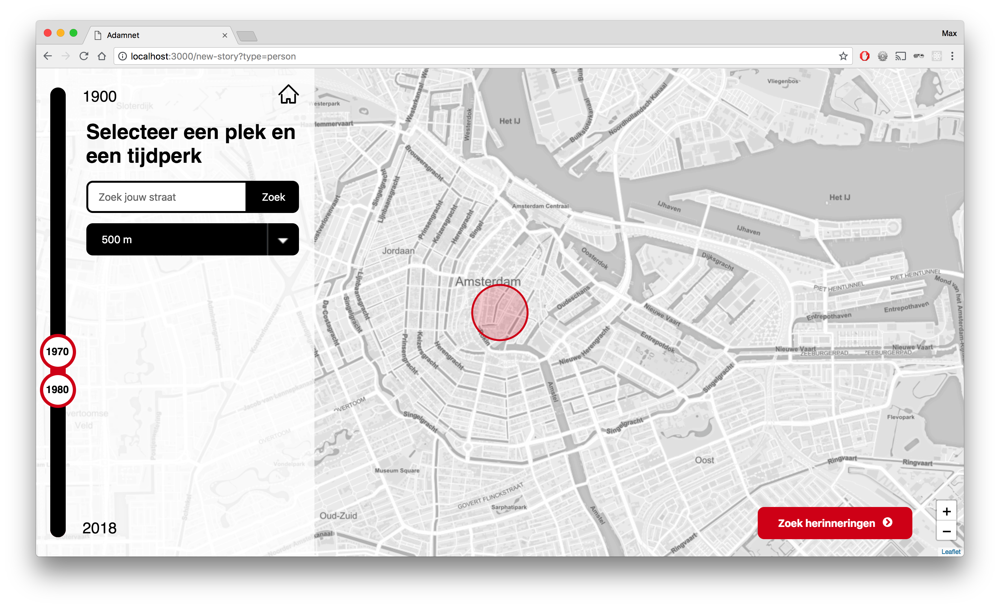
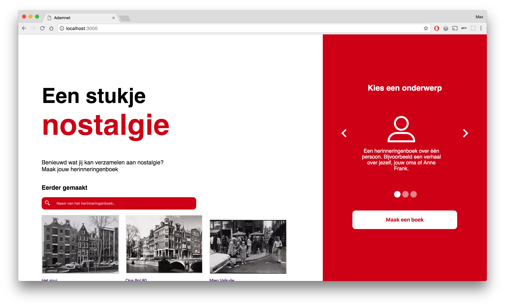
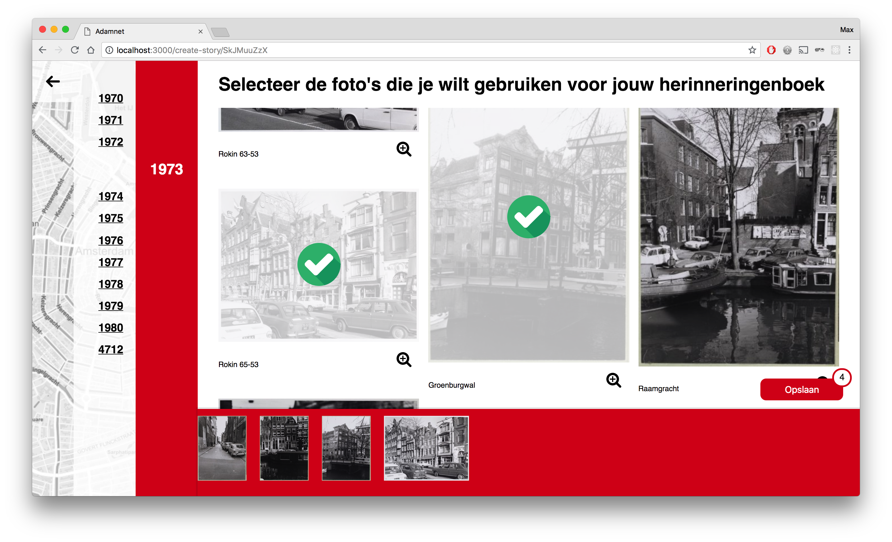
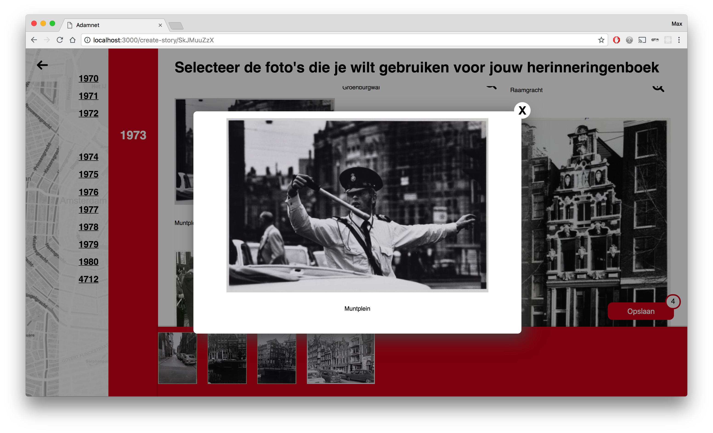
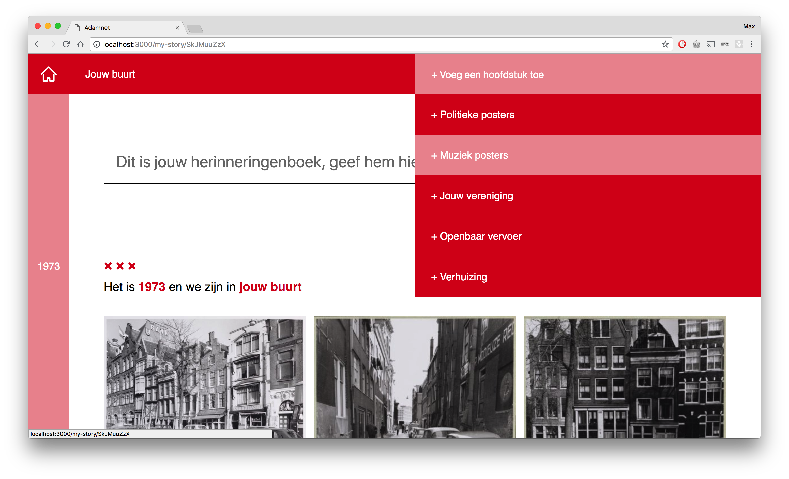
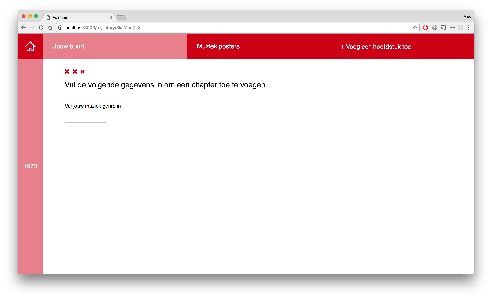
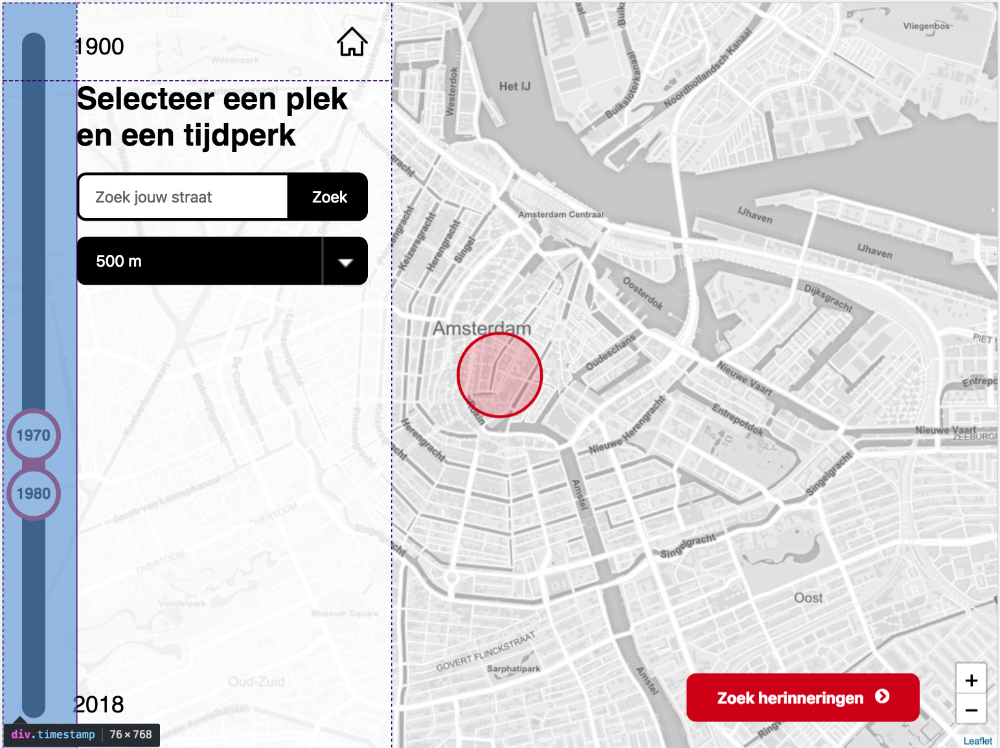
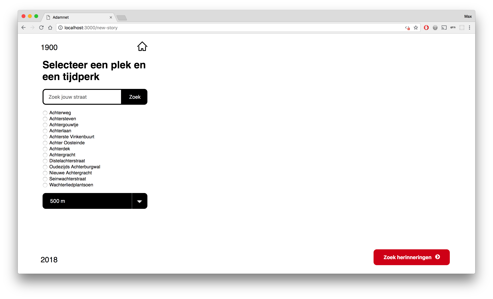
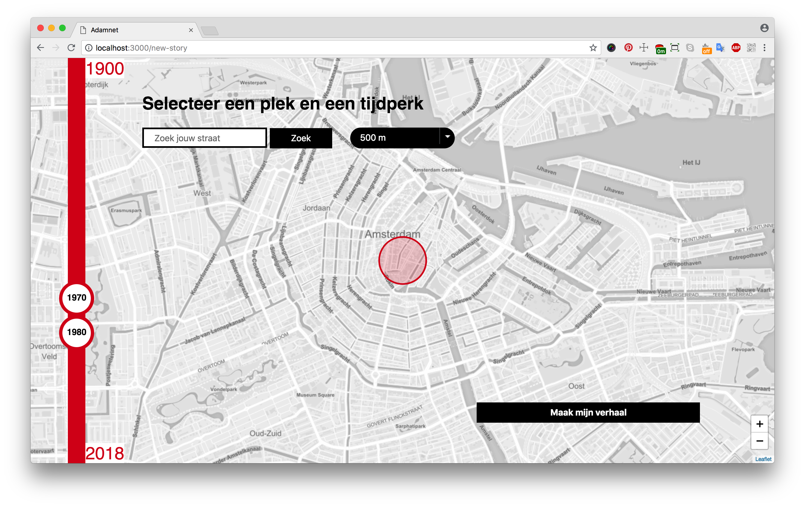
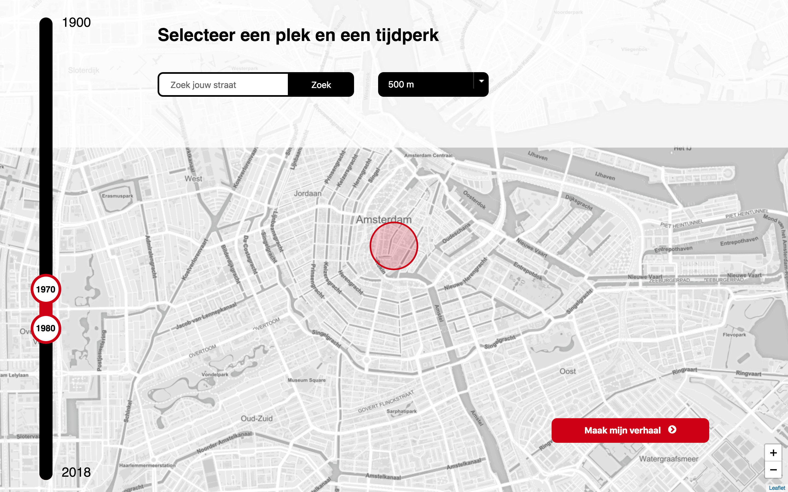

[](http://www.eenstukjenostalgie.amsterdam)

<div align="center">
  
  <h1>Meesterproef Adamnet</h1>
  <p>
    For the organisation <a href="http://www.adamnet.nl">Adamnet</a> we created the website <a href="http://www.eenstukjenostalgie.amsterdam">eenstukjenostalgie.amsterdam</a>, where people can create there own <strong>Memories Book</strong>, filled with images from a chosen time period and location.
  </p>
  
</div>
<br>

## Table of Contents

* [How to install](#how-to-install)
* [Frameworks](#frameworks)
* [Features](#features)
* [Project Information](#project-information)
* [User Scenarios](#user-scenarios)
* [Linked open data](#linked-open-data)
* [Usage](#usage)
* [Coming soon...](#coming-soon)
* [Wishlist](#wishlist)
* [Collaborators](#collaborators)

## How to install

First of all, download or clone the project, navigate to the root folder and install dependencies by `npm install`.
Create a `.env` file with the port number you want to start the server on, for example `PORT=3000`.
Run `npm run build` to build the bundle.js file and last of all, `npm start` to start the server and to work on our application!

## Frameworks

We have used the following frameworks and packages:

**Server:**
- [x] [Express JS](https://expressjs.com/)
- [x] [Express session](https://www.npmjs.com/package/express-session)
- [x] [Body parser](https://www.npmjs.com/package/body-parser)
- [x] [Node fetch](https://www.npmjs.com/package/node-fetch)

**Templating:**
- [x] [EJS](http://ejs.co/)

**Bundling:**
- [x] [Browserify](http://browserify.org/)

**Packages used for the map:**
- [x] [Turf](http://turfjs.org/)
- [x] [Circle to polygon](https://www.npmjs.com/package/circle-to-polygon)
- [x] [Wellknown](https://www.npmjs.com/package/wellknown)

**Generating IDs:**
- [x] [Uuid](https://www.npmjs.com/package/uuid)
- [x] [Shortid](https://www.npmjs.com/package/shortid)

## Features

**Homepage:**
* Create your book of memories of Amsterdam
* Choose between 3 themes:
  * Book about a person
  * Book about a building
  * A blank book to fill in yourself

**Selecting location and time period:**
* Select a location on the map based on a selected radius
* Search for your own street or a street of your choice
* Change the radius on the map to get a more or less precise location
* Select a time period between 1900 and 2018

**Selecting pictures:**
* Browse between the pictures, ordered by year
* Select the images you want to save in your book

**My memories book:**
* Give your book a title
* Browse between the selected pictures, ordered by year
* Browse between different chapters of your book, like 'Your street' or 'Your neighborhood'.
* Add new chapters from a selection of chapters
* Add or edit descriptions of your choice to the pictures.

## Project Information

[Adamlink](http://www.adamlink.nl), a project of [Adamnet](http://www.adamnet.nl), have made the Linked Open Data available for us. In this data you can find collections from Amsterdam. The collections are from ‘Beeldbank Stadsarchief’, ‘Amsterdams Museum’ , ‘IISG’ and ‘OBA’.

Adamlink asked us to create an interface where everybody is able to search for images (not only the people with SPARQL knowledge). This project is made for people with a background in Amsterdam. They may have lived their, or maybe their grandmother has lived in the city. But it could also be used by a teacher who wants to learn his students more about a specific part of Amsterdam.

### Concept
---

With [eenstukjenostalgie.amsterdam](http://www.eenstukjenostalgie.amsterdam) we are helping people to collect images they will give them memories back. By choosing a location and a time period, you will receive images of your neighborhood. If you like an image, you can save it to your memories book.

The good thing about our application is that you are not only looking for the most common results. The user will get surprised about the images they will find.

The memories book will not only be about your neighborhood. You have the option to add new chapters, like: political posters, music posters or about your primary school and more.

## User Scenarios

### Create a Memories Book for your grandma's birthday
---

Anne's grandma Miep is turning 80 next week, so Anne wants to give her something special for her birthday. She wants to make a collection of images from Miep's childhood. Anne knows Miep has lived in Amsterdam her entire life and knows that she lived somewhere in the Jordaan during her childhood. Where exactly, she doesn't know.

### Create a Memories Book of your childhood
---

Erik is 48 and lives in Amsterdam. During his childhood, he lived in the Ranonkelkade, in Amsterdam North. Erik feels nostalgic and would like to relive his childhood memories.

## Linked open data

The data we use is coming from [Adamlink](http://www.adamlink.nl) and is known as Linked Open Data. This means that all of the data in the Adamlink database are linked to each other or other databases. With Linked Open Data you can easily link data from one source to another. Links are made using **URIs**, like this one:

```
<http://www.opengis.net/ont/geosparql#>
```

### SPARQL
---

Fetching data from this database is done with SPARQL. SPARQL is an RDF query language, that is, a semantic query language for databases, able to retrieve and manipulate data stored in Resource Description Framework (RDF) format. *(Source: [Wikipedia](https://en.wikipedia.org/wiki/SPARQL))*

**An example of a SPARQL query we use:**

```
PREFIX rdfs: <http://www.w3.org/2000/01/rdf-schema#>
PREFIX hg: <http://rdf.histograph.io/>
PREFIX geo: <http://www.opengis.net/ont/geosparql#>
SELECT ?street ?name ?wkt WHERE {
  ?street a hg:Street .
  ?street rdfs:label ?name .
  ?street geo:hasGeometry/geo:asWKT ?wkt .
  FILTER (REGEX (?street, "Achter"))
}
```

This query fetches all the streets in Amsterdam that relate to the search term "Achter".

With SPARQL you use `PREFIX` to link to another data source. You select items from the database using `SELECT`, define the items you want to select with variables (`?name`). Selecting items from a database using SPARQL works using something called **triples**. You select an item using three variables. The first one is always the subject, the second and third one define the item and the relationship between the two.

### Our data flow
---

We fetch the pictures depending on the given begin and end timestamps we've gotten and the radius we get from the POST request from the page where we select the location and time period. This is the query we send to the API endpoint:

```
PREFIX dct: <http://purl.org/dc/terms/>
PREFIX foaf: <http://xmlns.com/foaf/0.1/>
PREFIX void: <http://rdfs.org/ns/void#>
PREFIX hg: <http://rdf.histograph.io/>
PREFIX geo: <http://www.opengis.net/ont/geosparql#>
PREFIX rdfs: <http://www.w3.org/2000/01/rdf-schema#>
PREFIX sem: <http://semanticweb.cs.vu.nl/2009/11/sem/>
PREFIX xsd: <http://www.w3.org/2001/XMLSchema#>
PREFIX dc: <http://purl.org/dc/elements/1.1/>
SELECT ?title ?img ?start ?end ?street ?streetLabel WHERE {
  # basic data
  ?cho dc:title ?title .
  ?cho foaf:depiction ?img .

  # temporal filter
  ?cho sem:hasBeginTimeStamp ?orgStart .
  ?cho sem:hasEndTimeStamp ?orgEnd .
  BIND (xsd:date(str(?orgStart)) AS ?start)
  BIND (xsd:date(str(?orgEnd)) AS ?end)
  FILTER BOUND (?start)
  FILTER BOUND (?end)
  FILTER (?start >= xsd:date("${beginTimestamp}") && ?end <= xsd:date("${endTimestamp}") )

  # spatial filter
  ?cho dct:spatial ?street .
  ?street a hg:Street ;
  geo:hasGeometry/geo:asWKT ?streetWkt ;
  rdfs:label ?streetLabel .
  BIND (bif:st_geomfromtext("${wkt}") as ?x)
  BIND (bif:st_geomfromtext(?streetWkt) AS ?y)
  FILTER(bif:GeometryType(?y)!='POLYGON' && bif:st_intersects(?x, ?y))
}
ORDER BY ?start
```

From there the user is creating it's own Memories book, which means we have to continue with an unique id. We add the selected data to an object for this current book and add this to the user's session storage. In the following pages, until we reach the final book, the data is transferred between each state.

This is what our data object looks like:

```
book: {
  "id": Bk7K2MZG7,
  "key": "null",
  "title": "Mijn verhaal van Amsterdam",
  "meta": {},
  "data": {
    "1940": {
      "de buurt": [img, img],
      "de overige straten": [img, img]
    },
    "1941": {
      "Sint Agnietenstraat": [img],
      "de buurt": [img, img],
      "de overige straten": [img, img]
    }
  },
  "selection": {
    "1940": {
      "de buurt": [img]
    }
  }
}
```

The `selection` object are all the images the user selects. They are filtered from the original `data` object.

## Usage

### State 1: Homepage
---

If you are arriving on the homepage you will find below the intro text memoriebooks made by others. You can search for a specific book, or just look around the images others have collected.

On the right side of the page you have the option to create your own book. You can pick a subject (person, building or blanco) and start your book.



### State 2: Selecting location and time period
---

On the second stage you will find a fullscreen map of Amsterdam. You have to select a time period by sliding the dots. You can either search for a specific street or drag the radius to a location at the map. When you are searching for a specific street, the position of the radius is changing on the map. If you want to change the size of the radius, you can select a radius in meters.

When the location and time period are as you would like, you can click on the submit button on the right to get your results.


### State 3: Selecting pictures
---

Yes, you have your first results now! On this page you can find the images that are in the time period you have selected and in the neighborhood that the radius pointed out. When you scroll down the page the year will shown up with a nice transition, so it will be clear which year the images are from. The years are clickable, you can easily navigate through the years.


On a hover you will find out that you can select each of the images. By clicking on the images you will add it to a red bar. At the same time a save button will shown up with the number of images you have added. You delete the image by unselecting the images or by clicking on the image in the red bar.



You can see every image in detail by clicking on the zoom icon.



By the way, on every page you have the option to go back to the previous page or homepage.

If you have selected all the images you would like to save, you click on the save button on the bottom right.

### State 4: My Memories Book
---

Now you arrived at your memories book page! This is the place where you can personalize your book. You can give it a title you would like and have a collection of the photo’s you have saved. Each year has different chapters. We have created two chapters for you in the first state: your street and your neighborhood.

Each image has a text that is editable. You can change the text or add some new lines if you would like.

You are able to add new chapters. You can find them by clicking on the button on the top right. By choosing on of the them you will create a new menu item in the top bar and create a new article on the page.



In the chapter you have to fill in a input field, which will search (coming soon..) for images.



## Coming soon...

* [ ] Delete fake years (for example 4712)
* [ ] When you are on the memories page, you are able to go back and add some more images (or delete)
* [ ] Loader icons will give the user more feedback what is going on
* [ ] You can change the radius on Android Chrome as well
* [ ] Lazy load will be added for loading the images
* [ ] The street you have searched for will be your new centerpoint
* [ ] You can save a story and this will added in the (MonogoDB)

## Wishlist

* **Photosuggestion:** on your memoriesbook page you will find photo’s that are similar to yours. The user will be finding new image because of this new feature.
* Enhancement design frontpage
* **New chapters (queries):**
  * school/uni/work
  * posters politic
  * posters music
  * public transport
  * moving out
* Adding a web worker
* Changing the leaflet map to a better version

## Collaborators
[Max de Vries](https://github.com/vriesm060) and [Suus ten Voorde](https://github.com/s44s) are the collaborators of this project.

If you want to know more about our process and testresults, check [this link](https://docs.google.com/document/d/13ffiy7-qafjm6pxHgUFO63iCZuLWXJ1KEM_uCn8LiBM/edit).

### Max
## Leerdoelen en reflectie

Mijn leerdoelen tijdens de Meesterproef waren om meer te leren over backend en over het communiceren tussen backend en frontend, om op een modulaire manier een Progressive Web App op te zetten en om vanuit een user scenario een goede flow neer te zetten.

Ik heb tijdens deze Meesterproef veel geleerd met betrekking tot mijn leerdoelen. Het was niet altijd makkelijk om backend werkt te doen en om goed te begrijpen hoe de server zich weerhoudt tot de client, maar uiteindelijk lukte mij dat en daar heb ik veel van geleerd. Ik snap nu beter hoe de server en de client communiceren en hoe je de server modulair kan opzetten.

Ik heb ook geleerd om tijdens het gehele proces altijd goed het user scenario in mijn achterhoofd te houden en dit terug te laten komen bij ontwerpbeslissingen. Het was ook goed dat we veel hebben getest en veel iteraties hebben gemaakt aan de hand van nieuwe test resultaten.

Naast mijn leerdoelen heb ik tijdens het samenwerken met Suus ook weer meer geleerd over het gebruik van GitHub. Ik had al eerder met anderen samengewerkt via GitHub, maar nog niet op zo'n goede manier. We hadden een heel duidelijke structuur aangemaakt. Door het gebruik van issues en het aanmaken van een project bord konden we heel duidelijk maken wie wat op welk moment deed, wat er nog gedaan moest worden en wat al af was. Dit werkte uitstekend.

Ook van de code reviews die Suus en ik bij elkaar deden bij elke Pull Request heb ik wat geleerd. Het was fijn dat ze scherp was op wat ik maakte, hoe mijn code stijl was en wat voor namen ik gaf aan variabelen en functies. Die feedback was mooi.

## Vakken

### WAFS
---

Wat ik geleerd heb tijdens WAFS heb ik goed terug kunnen brengen tijdens de Meesterproef. Ik heb de server modulair opgezet met de `app.js` als hoofdbestand. Daarna heb ik de eerste routes aangemaakt die we nodig hadden in het mapje `routes`. De express functies worden geëxporteerd vanuit een `controller.js` bestand. Deze modulaire opzet heb ik geleerd vanuit WAFS. Om te werken met zo'n app structuur. Ook heb ik vanuit WAFS meegenomen hoe je data vanuit een API kan inladen via fetch. Ik heb dat via de server gedaan met [Node fetch](https://www.npmjs.com/package/node-fetch).

**Via Node fetch ophalen van data:**
```
var fetchStreetWkts = async function () {
  var url = sparqlqueries.url(sparqlqueries.getStreetWkts(newStoryData.wkt));

  return await fetch(url)
    .then((resp => resp.json()))
    .then(function (data) {
      return data.results.bindings;
    })
    .catch(function (error) {
      console.log(error);
    });
}
```

**Pull requests waarin WAFS terug komt:**

* [Feature/data-routes](https://github.com/s44s/meesterproef-adamnet/pull/20)
* [Feature/first-data-filter](https://github.com/s44s/meesterproef-adamnet/pull/48)
* [Feature/data-flow-update](https://github.com/s44s/meesterproef-adamnet/pull/82)

### CSS to the Rescue
---

Vanuit CSS to the Rescue heb ik het gebruik van CSS Grid kunnen toepassen in het herontwerp van de pagina waar je een locatie en tijdperk moet instellen:



Dit heb ik op de volgende manier gedaan:

```
.new-story .meta-data {
  display: grid;
  grid-template-rows: 5rem 1fr;
  grid-template-columns: calc(5% + 3.5rem) 1fr;
  align-items: start;
}
```

```
.new-story .timestamp {
  grid-row: span 2;
  grid-column: 1/2;
}
```

**Pull requests waarin CSS to the Rescue terug komt:**

* [Feature/change-new-story-layout](https://github.com/s44s/meesterproef-adamnet/pull/115)

### Performance Matters
---

Een van de dingen die ik geleerd heb tijdens Performance Matters is hoe je server side modulair kan opbouwen. Dit heb ik dan ook toegepast in onze website. De `routes` zitten in een aparte map en de API calls en express functies zijn ook gescheiden.

Een ander onderdeel van Performance Matters is het daadwerkelijk verbeteren van de performance. Dit heb ik kunnen toevoegen door alle straten van Amsterdam asynchroon in te laden via client side JavaScript:

```
getAllStreets: async function () {
  return fetch('/js/streets.json')
    .then((res) => res.json())
    .catch(function (error) {
      console.log(error);
    })
},
```

`streets.json` is een lokaal bestand met de geo data van alle straten in Amsterdam. Het ophalen van deze gegevens via de API duurde aanzienlijk langer en was ook niet asynchroon. De rest het script moest wachten tot de data geladen werd, nu wordt de data geladen terwijl je de map en z'n functies al kan gebruiken.


**Pull requests waarin Performance Matters terug komt:**

* [Feature/data-routes](https://github.com/s44s/meesterproef-adamnet/pull/20)
* [Feature/fallback-for-selecting-location](https://github.com/s44s/meesterproef-adamnet/pull/72)

### Browser Technologies
---

Ik heb het vak Browser Technologies niet veel toegepast. Dit kwam doordat wij besloten hadden eerst de belangrijkste functies te bouwen en daarna, wel als enhancement, eventuele fallbacks te maken voor features.

Het enige waarbij ik wel een fallback gemaakt heb, is de zoekbalk. De core functionaliteit op deze pagina is namelijk het selecteren van een tijdperk en een locatie en wanneer er geen JavaScript aanwezig is, moet je alsnog een locatie kunnen selecteren. De map werkt dan niet meer en dus moet je wel terugvallen op de zoekbalk.

Vandaar dat ik hierop een fallback heb geschreven die een server side request doet en alle straten ophaald die voldoen binnen de gezochte waarde. Die fallback ziet er in de code zo uit in de server:

```
exports.searchLocationPage = function (req, res, next) {
  var url = sparqlqueries.url(sparqlqueries.getLocationBySearch(req.body.searchLocation));

  fetch(url)
    .then((resp) => resp.json())
    .then(function (data) {
      var rows = data.results.bindings;
      req.session.searchResults = rows;
      res.redirect('/new-story');
    })
    .catch(function (error) {
      console.log(error);
    });
}
```

En zo in gebruik:



**Pull requests waarin Browser Technologies terug komt:**

* [Feature/fallback-for-selecting-location](https://github.com/s44s/meesterproef-adamnet/pull/72)

### Web Design
---

Voor Web Design vond ik het belangrijk dat vanuit een user scenario de flow van de website goed zou lopen. Dit was ook een van mijn leerdoelen aan het begin van de Meesterproef.
We hadden gezamenlijk een mooi concept bedacht voor de user scenario van iemand die met nostalgische gevoelens zijn of haar jeugdherinneringen wil terughalen. (Zie [User Scenario](#user-scenario))

Dit concept had veel uitdagingen op het gebied van design en interactie. Door veel te testen met 'echte mensen' hebben we vele iteraties doorgevoerd. Aan het einde van de vierde week hadden we zelfs een groot deel van ons concept over hoop gehaald. Maar dit leidde wel tot een verbetering van ons concept.

**Eerste iteratie:**



**Tweede iteratie:**



**Laatste iteratie:**


