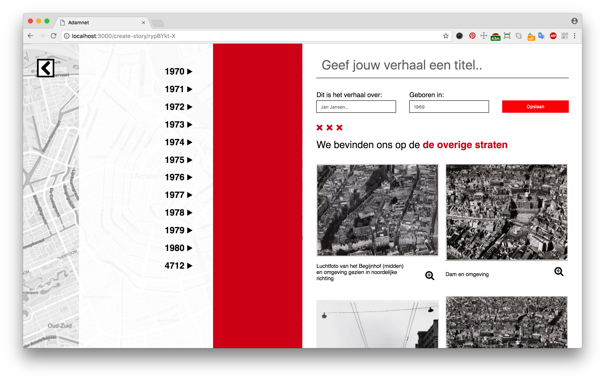
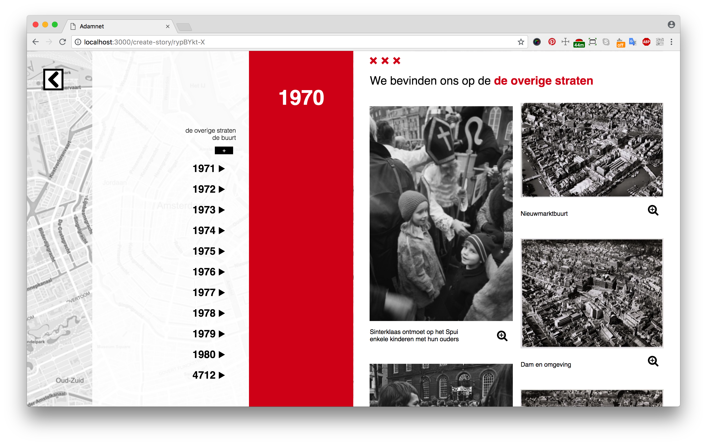
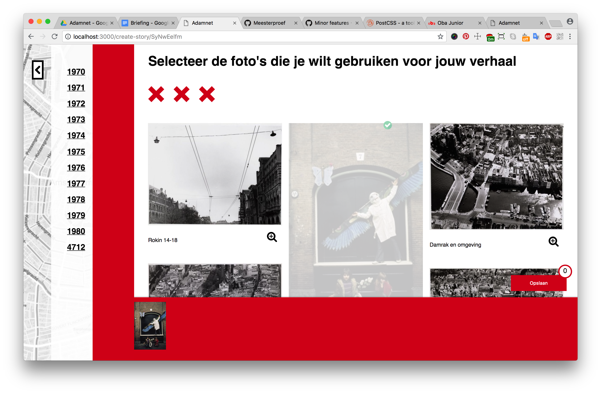
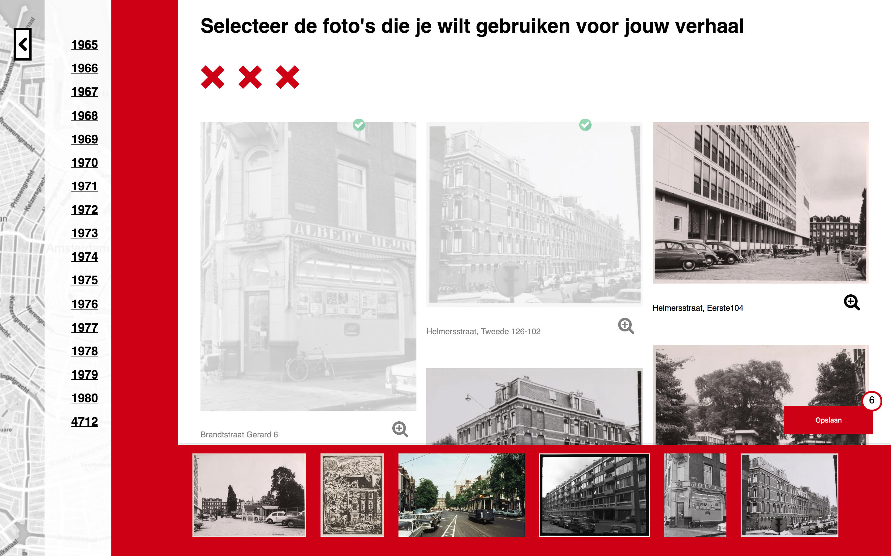
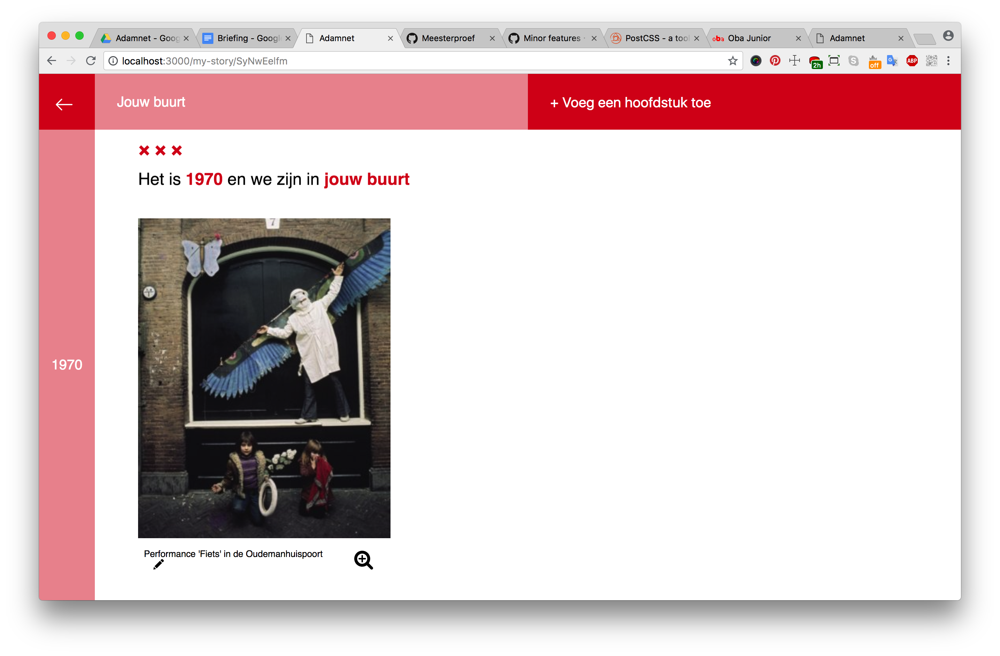

[](http://www.eenstukjenostalgie.amsterdam)

<div align="center">
  
  <h1>Meesterproef Adamnet</h1>
  <p>
    For the organisation <a href="http://www.adamnet.nl">Adamnet</a> we created the website <a href="http://www.eenstukjenostalgie.amsterdam">eenstukjenostalgie.amsterdam</a>, where people can create there own <strong>Memories Book</strong>, filled with images from a chosen time period and location.
  </p>
</div>
<br>

## Table of Contents

* [How to install](#how-to-install)
* [Frameworks](#frameworks)
* [Features](#features)
* [Project Information](#project-information)
* [User Scenarios](#user-scenarios)
* [Linked open data](#linked-open-data)
* [Usage](#usage)
* [Coming soon...](#coming-soon...)
* [Wishlist](#wishlist)
* [Collaborators](#collaborators)

## How to install

First of all, download or clone the project, navigate to the root folder and install dependencies by `npm install`.
Create a `.env` file with the port number you want to start the server on, for example `PORT=3000`.
Run `npm run build` to build the bundle.js file and last of all, `npm start` to start the server and to work on our application!

## Frameworks

We have used the following frameworks and packages:

**Server:**
- [x] [Express JS](https://expressjs.com/)
- [x] [Express session](https://www.npmjs.com/package/express-session)
- [x] [Body parser](https://www.npmjs.com/package/body-parser)
- [x] [Node fetch](https://www.npmjs.com/package/node-fetch)

**Templating:**
- [x] [EJS](http://ejs.co/)

**Bundling:**
- [x] [Browserify](http://browserify.org/)

**Packages used for the map:**
- [x] [Turf](http://turfjs.org/)
- [x] [Circle to polygon](https://www.npmjs.com/package/circle-to-polygon)
- [x] [Wellknown](https://www.npmjs.com/package/wellknown)

**Generating IDs:**
- [x] [Uuid](https://www.npmjs.com/package/uuid)
- [x] [Shortid](https://www.npmjs.com/package/shortid)

## Features

**Homepage:**
* Create your book of memories of Amsterdam
* Choose between 3 themes:
  * Book about a person
  * Book about a building
  * A blank book to fill in yourself

**Selecting location and time period:**
* Select a location on the map based on a selected radius
* Search for your own street or a street of your choice
* Change the radius on the map to get a more or less precise location
* Select a time period between 1900 and 2018

**Selecting pictures:**
* Browse between the pictures, ordered by year
* Select the images you want to save in your book

**My memories book:**
* Give your book a title
* Browse between the selected pictures, ordered by year
* Browse between different chapters of your book, like 'Your street' or 'Your neighborhood'.
* Add new chapters from a selection of chapters
* Add or edit descriptions of your choice to the pictures.

## Project Information

[Adamlink](http://www.adamlink.nl), a project of [Adamnet](http://www.adamnet.nl), have made the Linked Open Data available for us. In this data you can find collections from Amsterdam. The collections are from ‘Beeldbank Stadsarchief’, ‘Amsterdams Museum’ , ‘IISG’ and ‘OBA’.

Adamlink asked us to create an interface where everybody is able to search for images (not only the people with SPARQL knowledge). This project is made for people with a background in Amsterdam. They may have lived their, or maybe their grandmother has lived in the city. But it could also be used by a teacher who wants to learn his students more about a specific part of Amsterdam.

### Concept
---

With [eenstukjenostalgie.amsterdam](http://www.eenstukjenostalgie.amsterdam) we are helping people to collect images they will give them memories back. By choosing a location and a time period, you will receive images of your neighborhood. If you like an image, you can save it to your memories book.

The good thing about our application is that you are not only looking for the most common results. The user will get surprised about the images they will find.

The memories book will not only be about your neighborhood. You have the option to add new chapters, like: political posters, music posters or about your primary school and more.

## User Scenarios

### Create a Memories Book for your grandma's birthday
---

Anne's grandma Miep is turning 80 next week, so Anne wants to give her something special for her birthday. She wants to make a collection of images from Miep's childhood. Anne knows Miep has lived in Amsterdam her entire life and knows that she lived somewhere in the Jordaan during her childhood. Where exactly, she doesn't know.

### Create a Memories Book of your childhood
---

Erik is 48 and lives in Amsterdam. During his childhood, he lived in the Ranonkelkade, in Amsterdam North. Erik feels nostalgic and would like to relive his childhood memories.

## Linked open data

The data we use is coming from [Adamlink](http://www.adamlink.nl) and is known as Linked Open Data. This means that all of the data in the Adamlink database are linked to each other or other databases. With Linked Open Data you can easily link data from one source to another. Links are made using **URIs**, like this one:

```
<http://www.opengis.net/ont/geosparql#>
```

### SPARQL
---

Fetching data from this database is done with SPARQL. SPARQL is an RDF query language, that is, a semantic query language for databases, able to retrieve and manipulate data stored in Resource Description Framework (RDF) format. *(Source: [Wikipedia](https://en.wikipedia.org/wiki/SPARQL))*

**An example of a SPARQL query we use:**

```
PREFIX rdfs: <http://www.w3.org/2000/01/rdf-schema#>
PREFIX hg: <http://rdf.histograph.io/>
PREFIX geo: <http://www.opengis.net/ont/geosparql#>
SELECT ?street ?name ?wkt WHERE {
  ?street a hg:Street .
  ?street rdfs:label ?name .
  ?street geo:hasGeometry/geo:asWKT ?wkt .
  FILTER (REGEX (?street, "Achter"))
}
```

This query fetches all the streets in Amsterdam that relate to the search term "Achter".

With SPARQL you use `PREFIX` to link to another data source. You select items from the database using `SELECT`, define the items you want to select with variables (`?name`). Selecting items from a database using SPARQL works using something called **triples**. You select an item using three variables. The first one is always the subject, the second and third one define the item and the relationship between the two.

### Our data flow
---

<!-- Add Actor diagram -->

## Usage

### State 1: Homepage
---

If you are arriving on the homepage you will find below the intro text memoriebooks made by others. You can search for a specific book, or just look around the images others have collected.

On the right side of the page you have the option to create your own book. You can pick a subject (person, building or blanco) and start your book.

<!-- Screenshot of homepage -->

### State 2: Selecting location and time period
---

On the second stage you will find a fullscreen map of Amsterdam. You have to select a time period by sliding the dots. You can either search for a specific street or drag the radius to a location at the map. When you are searching for a specific street, the position of the radius is changing on the map. If you want to change the size of the radius, you can select a radius in meters.

When the location and time period are as you would like, you can click on the submit button on the right to get your results.

<!-- Screenshot of new-story page -->

### State 3: Selecting pictures
---

Yes, you have your first results now! On this page you can find the images that are in the time period you have selected and in the neighborhood that the radius pointed out. When you scroll down the page the year will shown up with a nice transition, so it will be clear which year the images are from. The years are clickable, you can easily navigate through the years.

<!-- Screenshot of one selected year -->

On a hover you will find out that you can select each of the images. By clicking on the images you will add it to a red bar. At the same time a save button will shown up with the number of images you have added. You delete the image by unselecting the images or by clicking on the image in the red bar.

<!-- Screenshot of selected images in selection bar -->

You can see every image in detail by clicking on the zoom icon.

<!-- Screenshot of image in detail view -->

By the way, on every page you have the option to go back to the previous page or homepage.

If you have selected all the images you would like to save, you click on the save button on the bottom right.

### State 4: My Memories Book
---

Now you arrived at your memories book page! This is the place where you can personalize your book. You can give it a title you would like and have a collection of the photo’s you have saved. Each year has different chapters. We have created two chapters for you in the first state: your street and your neighborhood.

Each image has a text that is editable. You can change the text or add some new lines if you would like.

You are able to add new chapters. You can find them by clicking on the button on the top right. By choosing on of the them you will create a new menu item in the top bar and create a new article on the page.

<!-- Screenshot of selecting a chapter -->

In the chapter you have to fill in a input field, which will search (coming soon..) for images.

<!-- Screenshot of new chapter input field -->

<!-- Maybe something about saving -->

## Coming soon...

* [ ] Delete fake years (for example 4712)
* [ ] When you are on the memories page, you are able to go back and add some more images (or delete)
* [ ] Loader icons will give the user more feedback what is going on
* [ ] You can change the radius on Android Chrome as well
* [ ] Lazy load will be added for loading the images
* [ ] The street you have searched for will be your new centerpoint
* [ ] You can save a story and this will added in the (MonogoDB)

## Wishlist

* **Photosuggestion:** on your memoriesbook page you will find photo’s that are similar to yours. The user will be finding new image because of this new feature.
* Enhancement design frontpage (see images below)

<!-- Screenshot of design home -->

* **New chapters (queries):**
  * school/uni/work
  * posters politic
  * posters music
  * public transport
  * moving out
* Adding a web worker
* Changing the leaflet map to a better version

## Collaborators
[Max de Vries](https://github.com/vriesm060) and [Suus ten Voorde](https://github.com/s44s) are the collaborators of this project.

If you want to know more about our process and testresults, check [this link](https://docs.google.com/document/d/13ffiy7-qafjm6pxHgUFO63iCZuLWXJ1KEM_uCn8LiBM/edit).

### Suus
Een van mijn leerdoelen van dit project was om GEEN spaghetti code meer te schrijven. Tijdens deze minor heb ik ontzettend veel geleerd, voornamelijk over Javascript. Misschien zelfs zoveel dat ik dit niet altijd goed in mij heb kunnen opnemen. Deze meesterproef wilde ik meer begrijpen wat ik nou precies aan code heb geschreven en wat het precies betekent. Daarnaast heb ik gemerkt dat het concepten wel goed gaat, alleen de uitwerking daarvan vaak te kort doet hieraan. Hierdoor komt het concept niet altijd even goed over zoals ik had gehoopt, terwijl ik dit verbaal wel goed kan uitwerken. Het tweede leerdoel van de meesterproef is daarom ook om het prototype voor zichzelf te laten spreken, het concept moet goed naar voren komen. Om dit goed over te laten komen, moet de flow juist in elkaar zitten en moet er op interactie gebied met wat meer liefde hiernaar worden gekeken.

Tijdens de eerste week van de meesterproef had ik besloten om met Max samen te werken. Dit is één van de beste keuzes die ik heb gemaakt. Door mijn eigenwijsheid vind ik samenwerken soms best lastig, maar naar mijn idee ging deze samenwerking heel fijn. Max gaf goed aan wat hij de beste manier vond om iets te oplossen en ik die van mij. Wanneer we het ergens niet over eens waren, dan kwamen we altijd op een middenweg uit.

Mijn eerste leerdoel was geen spaghetti code meer te schrijven. Dat dit gelukt is heb ik grotendeels te danken aan onze samenwerking. Doordat we duidelijke afspraken hadden gemaakt hoe we met GIT om gingen, moesten we elkaar telkens reviewen voor de branch gemerged kon worden. Dit zorgde ervoor dat Max feedback op mijn code gaf en ik op die van hem. Hier heb ik heel veel van geleerd. Het waren vaak kleine tips, maar die zorgde wel voor veel verbetering.

Dit is een voorbeeld van z'n feedback moment. Max gaf aan dat de naamgeving hier niet duidelijk genoeg was.

```javascript
var fetch = require('node-fetch');
var sparqlqueries = require('./sparql');

exports.location = async function (newStoryData) {
  // Fetch the images for selected location and timestamp:
  var url = sparqlqueries.url(sparqlqueries.getLocationAndTimestamp(newStoryData));

return await fetch(url)
	  .then((resp) => resp.json()) // transform the data into json
    .then(function (data) {

			var dataFilter = data.results.bindings;

			var all = {
				years: {}
			};

			dataFilter.forEach(function(item, i, self) {
		  	var year = item.start.value.split('-')[0];
				var chapter;

				if (item.street.value == dataFilter[0].street.value) {
					chapter = dataFilter[0].streetLabel.value;
				} else {
					chapter = 'de overige straten';
				}

		    if (!all.years[year]) {
		    	all.years[year] = {};
		    }
				if (!all.years[year][chapter]) {
					all.years[year][chapter] = [];
				}

				all.years[year][chapter].push(item);
			});

			return all;

    }).catch(function (error) {
      console.log(error);
    });
};
```

Als laatste doel wilde ik de flow duidelijk maken van de applicatie zodat ons concept goed naar voren kwam. De twee testmomenten die we gehad hebben, heeft hierbij heel erg geholpen. Vorige week vrijdag kwamen we tot de conclusie dat onze huidige flow niet logisch genoeg was. We hebben er daarom voor gekozen om dit op het laatste moment nog aan te passen. Dit heeft even voor wat hoofdpijn en stress momenten gezorgd, maar is naar mijn mening een hele belangrijke stap geweest. Overall ben ik erg tevreden met wat we hebben neergezet en ik denk dat het concept goed naar voren komt.


*Web App from Scratch:* Een belangrijk punt wat we hebben meegenomen van WAFS is de indeling van de applicatie. We hebben allereerst goed gekeken hoe we de app gingen opbouwen voordat we als een kip zonder kop begonnen met coderen. Zo hebben we een aparte routes map met alle routes daarin gedefineerd en in de controllers map staan de sparql queries, de data filters en de data die we meesturen aan de routes. Hierdoor houden we overzicht. Daarnaast hebben we meerdere data methodes toegepast, onder andere de filter() en map() functie. Een request maken naar de api met een fetch hebben we ook mee kunnen nemen vanuit WAFS en project1.

*CSS to the Rescue:* Dit vak heb ik voornamelijk kunnen toepassen. We hebben  niet al te veel met CSS selectors gewerkt (sorry Vasilis), maar voornamelijk met classes. Uit CSS hebben we nieuwe features gebruikt als Column-layout, Grid en CSS properties. We hebben geprobeerd te letten op focus states, maar hier lag niet onze prioriteit. Een handig trucje wat ik uit CSSTR heb meegenomen is de volgende:

```CSS
.my-story h2 {
	height: min-content;
}
```

*Performance Matters: *
We hebben geprobeerd om dit vak zo goed mogelijk toe te passen, omdat het voor onze site best een issue zou kunnen worden met het aantal data dat er beschikbaar is. Dit hebben we gedaan door bijvoorbeeld in modules te werken en het asynch inladen van een .json file van de straten.

*Browser Tech: * In dit vak heb ik heel veel geleerd over hoe browsers dingen verschillend implenteren. Bij het maken van een CSS keuze (bv: gaan we grid of flex gebruiken), neem ik de browser-ondersteuning ook mee in mijn overweging. Verder heeft Max een fallback geschreven voor wanneer Javascript uitstaat.

*Web design:* Het belangrijkste wat we van Web Design hebben toegepast is de flow van onze website. We hadden een prachtig concept bedacht, wat veel uitdagingen had op het gebied van design en interactie. Door het meerdere keren te testen met de 'echte' doelgroep hebben we hier meerdere iteraties op kunnen maken die ook zeker voor veel veranderingen hebben gezorgd. In mijn procesboek zijn deze veranderingen duidelijk te vinden. Ook via [deze link](https://docs.google.com/document/d/13ffiy7-qafjm6pxHgUFO63iCZuLWXJ1KEM_uCn8LiBM/edit). is er meer te lezen waarom we bepaalde aanpassingen hebben gedaan. Om ze nog wat beter toe te lichten hier ook een aantal screenshots van de iteraties:

Iteratie 1:




Iteratie 2:








Iteratie 3: check onze live website voor de nieuwe iteratie [een stukje nostalgie](http://eenstukjenostalgie.amsterdam/)


